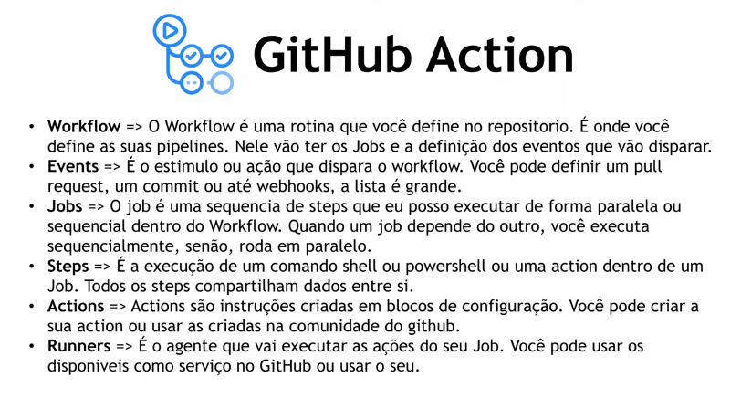

# Aula 3 - CI/CD e Digital Ocean

- Pipeline: sequência de instruções que são executadas pra automatizar um processo, elas  podem ser executadas de forma paralela ou sequêncial. No caso de microserviços tem que subir novas versões constantemente e fazer todo o processo de validação e deploy se torna trabalhoso e fica inseguro, pois alguém pode esquecer de executar alguma etapa. Quando as etapa são executadas de forma automática há uma confiabilidade e segurança muito maior.
- Integração contínua (CI): um código novo vai ser inserido na aplicação, em um código já existente. Pra isso acontecer de forma segura e confiável, precisa seguir umas etapas. Então toda vez que um desenvolvedor envia o código pro repositório, será executada uma pipeline de CI/CD que contém, por exemplo, teste unitário, verificação de qualidade de código, teste de integração, construção de build, construção da imagem e etc. Essas etapas são executadas sequencialmente ou paralelamente. Depois da validação, o código será incorporado na aplicação e será criado um artefato de entrega, como um executável, uma imagem docker e etc.
- Deploy contínuo (CD): pega o artefato de entrega gerado pelo CI, pode fazer outros testes e se for aprovado, faz todo o processo de deploy desse artefato em um ambiente (produção, desenvolvimento, homologação e etc).

- GitHub Actions: permite a criação de pipelines. 
   - Workflow: é onde define as pipelines que contém os jobs e a definição dos eventos que vão disparar.
   - Events: É a ação que dispara o workflow.
   - Jobs: é uma sequência de steps que pode executar de forma paralela ou sequencial dentro do workflow. Quando um jon depende do outro, será executado sequencialmente e não paralelamente.
   - Steps: é a execução de um comando shell, powershell ou uma action dentro de um job.
   - Actions: são instruções criadas em blocos de configuração. Pode criar sua própria action ou usar as da comunidade.
   - Runners: é o agente que vai executar as ações do seu job.