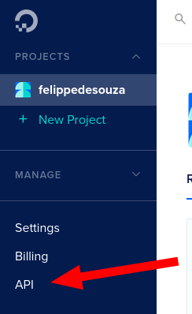
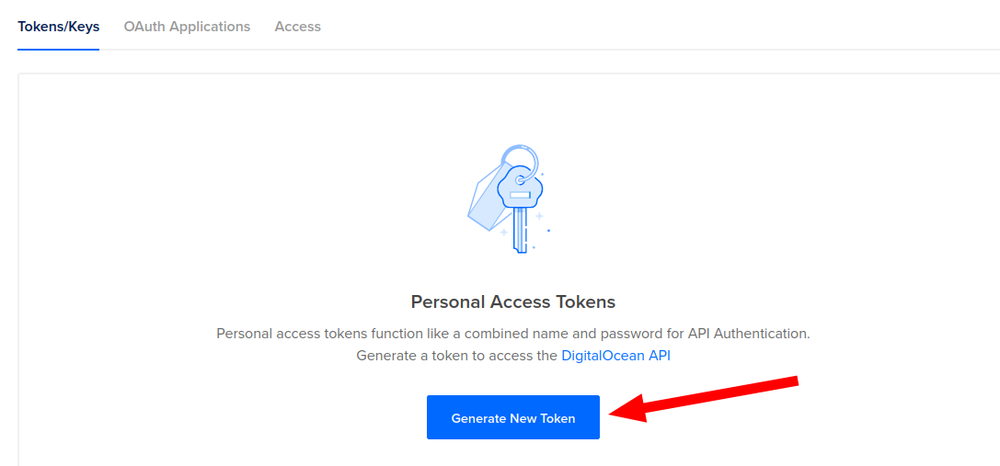
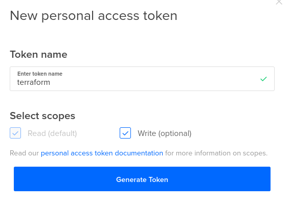
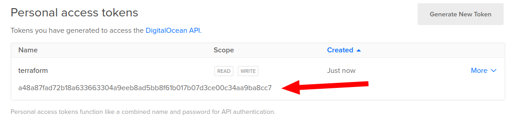
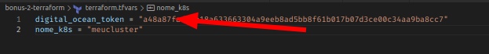

# Bônus 2 - Terraform

## Execução

1. `terraform init` para iniciar o projeto e baixar os providers
1. gere um token na digital ocean para o terraform conseguir ter acesso para criar o cluster kubernetes

1. cole o token no arquivo `terraform.tfvars`

1. `terraform apply` para construir a infra baseado no .tf
1. copia o arquivo `kube_config`, cola no `~/.kube/config` e no secrets do github actions
1. `kubectl apply -f ./k8s/deployment.yaml`

## Comandos

- `terraform init`: iniciar o projeto, baixar os providers, p conseguir se conectar com o servico de nuvem. Se colocar algum outro provider, precisa executar esse comando novamente.
- `terraform plan`: diz o que vai ser feito no serviço de nuvem. Mostra tudo que vai ser executado no arquivo .tf
- `terraform apply`: executa o que esta declarado no arquivo .tf e cria .tfstate (estado da infraestrutura). Caso queira atualizar o estado da infra, é só executar esse comando.
- `terraform destroy`: remove tudo que foi criado pelo .tf

## Dicas

- não pode deletar o tfstate, pois la esta descrito o estado atual do resource.
- use o terraform pra criar o cluster kubernetes e conseguir usar a pipeline CI/CD.
- use variables pra variaveis sensiveis como tokens ou compos que o valor se repete muito ou deve ser flexivel a mudanças, como o nome do cluster.

## Vantagens

- compartilhar a mesma infraestrutura pra equipe
- uma linguagem para vários providers (aws, azure, digital ocean, google)
- automatiza a criação da infra (IaaC - Infrastructure as a Code)

## Comparação entre as formas de criar a infra

- GUI (site): é o pior, pois é manual. Não da pra automatizar, depende da memoria humana pra executar cada tarefa em ordem e sem esquecer.
- linha de comando: é mais automático, mas mesmo assim precisa escrever linhas para criar, atualizar e remover. É preciso ter um conhecimento para gerenciar e saber a ordem do que executar.
- sdk: é menos trabalhoso, mas mesmo assim precisa ter um conhecimento razoavel do provider pra escrever o código. Depende muito da pessoa que criou o código, há uma possibilidade de dar erro na logica.
- terraform: já vem tudo pronto, só precisa dizer o provider e os recursos que vao ser usados. Não é necessario um conhecimento profundo na ordem de ações para criar, atualizar e remover os recursos, a ferramenta já faz tudo isso. É declarativo e não imperativo, você não precisa implementar os detalhes, só é preciso dizer o que deseja que a propria ferramenta irá implementar a execução baseado na declaração feita.
